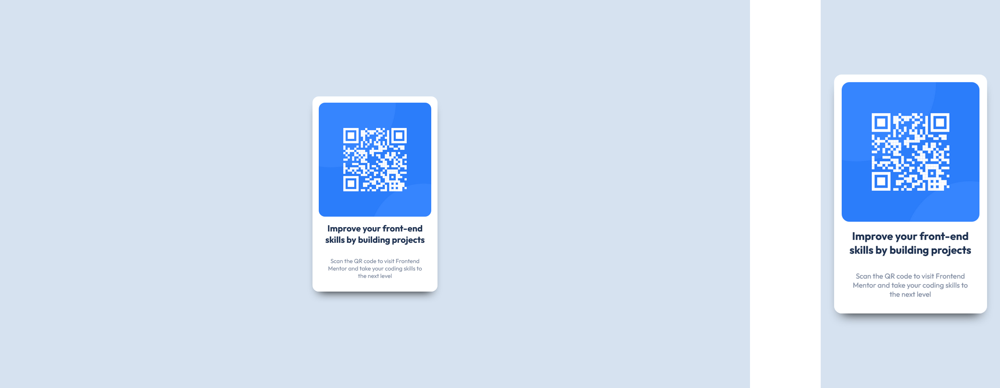

# Frontend Mentor - QR code component solution

This is a solution to the [QR code component challenge on Frontend Mentor](https://www.frontendmentor.io/challenges/qr-code-component-iux_sIO_H). Frontend Mentor challenges help you improve your coding skills by building realistic projects.

Solution count : 2

## Table of contents

- [Overview](#overview)
  - [Screenshot](#screenshot)
  - [Links](#links)
- [My process](#my-process)
  - [Built with](#built-with)
- [Author](#author)

## Overview

This was another project I solved on Frontend Mentor to practice my CSS skills

### Screenshot

### Links

- Solution URL: [https://github.com/Rupsnigdha/frontendmentor-qr-code-component.git](https://github.com/Rupsnigdha/frontendmentor-qr-code-component.git)
- Live Site URL: [Add live site URL here](https://your-live-site-url.com)

## My process

### Built with

- Semantic HTML5 markup
- CSS custom properties
- Flexbox

## Author

Rupsnigdha Kashyap

- Frontend Mentor - [@Rupsnigdha](https://www.frontendmentor.io/profile/Rupsnigdha)
- Twitter - [@rupsnigdha](https://twitter.com/rupsnigdha)
